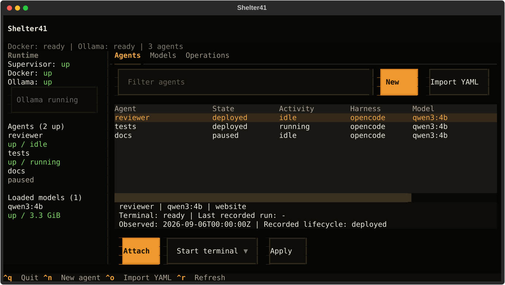
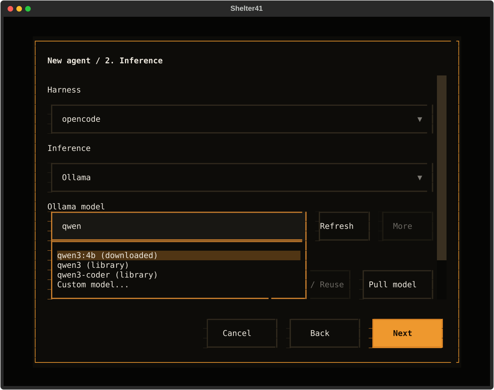
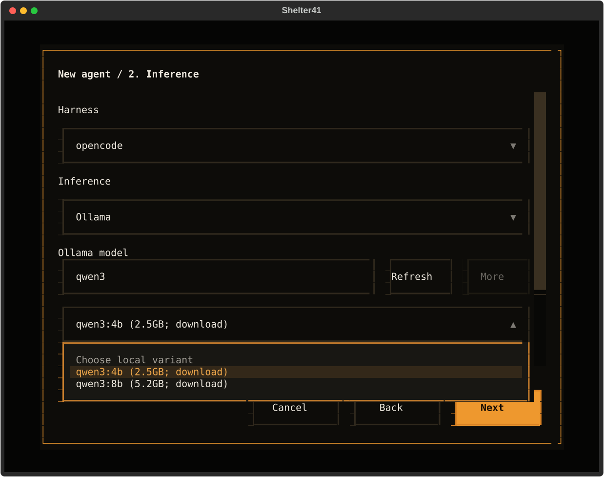

# Shelter41 Local

Run coding agents on your machine. Choose a harness and model, give each agent a
working directory, and return to its terminal whenever you need it.

**No Shelter41 account or cloud service required.** Docker runs the agents;
SQLite keeps local state. Pre-release MVP, tested on macOS. Linux is experimental.



## Get Started

You need **Python 3.12+, Git, and a running Docker Desktop**.
Install [Ollama](https://ollama.com/download) for local models, or use your existing
Codex / Claude Code login or a compatible model endpoint. No host tmux is needed.

From this repository:

```sh
python3.12 -m venv .venv
source .venv/bin/activate
pip install -e .
sh41 doctor
sh41
```

Keep this virtual environment active: the cloud CLI also uses the name `sh41`.
This package is not on PyPI yet. The first deployment builds its Docker image and
needs internet access.

## Create Your First Agent

1. Select **New** and give the agent a name and source directory.
2. Choose a harness and model. For local inference, choose **OpenCode + Ollama**.
3. Select **Save and Start**, then select the agent and **Attach**.

Claude and Codex offer only their native models, plus an account-default option.
Claude includes Fable 5.1, Opus 5, Sonnet 5, Haiku 4.5 and older active versions;
availability depends on your account. [Model choices](docs/USAGE.md#native-claude-models)
Ollama and compatible endpoints are available with OpenCode.

A Git repository gets its own worktree and branch, starting from committed `HEAD`.
For a non-Git folder, choose **Original folder** or **Private copy**.
**Save Only** writes the YAML without creating an agent or downloading anything.

Type in the model field to search downloaded models and the Ollama library:



Choose a local variant and download size. **Pull model** confirms the selected
tag; **Save and Start** also downloads missing weights. Cloud-only models cannot
run locally. Use **Start Ollama** in the sidebar when the server is stopped.



*Screenshots show the actual terminal UI with sample agents and model data.*

**Ctrl-b, then d** detaches from an agent. **Ctrl-q** closes the control panel.
Neither stops your agents. Use an 80x24 terminal or larger.

## Prefer Commands?

Already signed into Codex on this machine?

```sh
sh41 codex-auth
sh41 launch reviewer --harness codex --source ./my-repo
sh41 attach reviewer
```

For Claude Code, use `sh41 claude-auth` and `--harness claude-code`.
For Ollama, use `--harness opencode --ollama --model qwen3:4b`.

| Command | Action |
| --- | --- |
| `sh41 ls` | List agents |
| `sh41 run reviewer --message "Review the code"` | Submit a task |
| `sh41 pause reviewer` / `sh41 resume reviewer` | Stop / restart compute |
| `sh41 park reviewer` / `sh41 redeploy reviewer` | Remove / recreate the container, keeping files and history |
| `sh41 --help` | See all commands |

## Deploy From YAML

```yaml
version: 1
agent: reviewer
harness: opencode
model: qwen3:4b
inference:
  provider: ollama
source:
  provider: local
  path: ./my-repo
  mode: worktree
sandbox:
  provider: docker
```

Run `sh41 deploy reviewer.yaml`. Paths are relative to the YAML file.
`sh41 launch` generates YAML from flags; add `--write-only` to generate it without
deploying. See [examples](examples/) for MCP servers and compatible endpoints.

## Before You Start

- Worktrees exclude uncommitted source changes, but **share Git metadata and history**.
- Original-folder mode lets the agent edit host files, including hidden files.
- Agents run unattended in Docker. Only grant source access and credentials you trust them with.
- Files and conversations persist locally under `~/.local/share/sh41-local`.
- Submodule worktrees are not supported yet. Local model quality and RAM needs vary.

## More

[Usage and troubleshooting](docs/USAGE.md) | [Architecture](SPECS.md) |
[Tests and development](TESTING.md) | [Decisions](DECISIONS.md)

**License:** [Apache-2.0](LICENSE). Harnesses and model weights have their own licenses.
