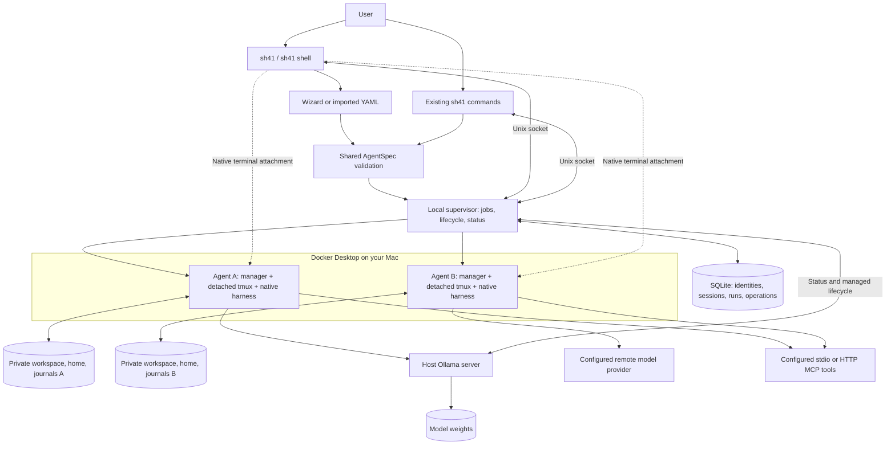

# sh41 Shell MVP

The shell is a detachable control panel, not the owner of agent processes.
This project remains independent from the Shelter41 SaaS platform.
The subsequent [coding-directory plan](CODING_DIRECTORY_PLAN.md) adds SQLite v3
bindings, real Git worktrees, and explicit direct-folder access; the phase records
below describe the original shell release.

## Phases and acceptance

1. **Supervisor foundations:** non-mutating, bounded status probes; SQLite v2
   operations; asynchronous accepted jobs survive shell exit. Test migrations,
   duplicate requests, writer exclusion, slow/unavailable probes and interrupted
   supervisor recovery. No uncertain operation is automatically replayed.
2. **Dashboard:** Textual Agents/Models views, filters, details, health, operations,
   keyboard and mouse. Poll agents every two seconds and models every five seconds
   without overlap. Test 80x24/120x40, long labels, 100 rows and reconnection.
3. **Native terminals:** explicit detached Start, native attach/detach, read-only
   access, lifecycle, conversations, history and export. Test real Docker/PTY
   isolation, closing/killing/reopening the shell, writer rules and persistence.
4. **Creation wizard:** identity/source, supported harness/inference, optional
   instructions and structured MCP fields, YAML review, Save Only/Save and Start.
   Test equivalent flags/YAML, validation, credentials, collisions and recovery.
5. **Ollama:** server status and ownership, downloaded versus loaded models,
   start/reuse, pull progress, guarded stop; scriptable status/ps/start commands.
   Test passive discovery, partial API errors, ownership, pulls and actual loading.
6. **macOS acceptance:** complete two-agent workflow, full regressions, lint,
   installed-wheel and real terminal checks, user/architecture/decision docs.

## Boundaries

macOS-first; Docker only; no SaaS dependency, host tmux installation, embedded
terminal emulator, unified chat renderer, GPU telemetry or model deletion.
Closing the shell does not stop agents or accepted jobs. Stopping Docker does
interrupt compute; identities, files and conversations remain durable. Linux
certification and a full-machine reboot are not MVP release gates.

## Implementation record (2026-09-06)

All six phases are implemented. The user-facing entrypoints are `sh41`,
`sh41 shell`, `sh41 start NAME`, and `sh41 models start/status/ps` in addition to
the original commands. No agent YAML fields or cloud interfaces were changed.
The final combined non-live suite, with Docker and the installed-wheel gate
enabled, passed **64 tests** (13 opt-in live cases deselected). The actual Ollama
edit/test and loaded-model observation passed separately.

- Phase 1: migration preservation, asynchronous acceptance, duplicate-operation
  rejection, secret-free operation storage, non-blocking/unknown observations,
  passive Ollama discovery and partial API failures pass in `test_control.py`.
- Phases 2 and 4: nine Textual/CLI tests pass, including 80x24 and 120x40,
  100 agents, stale/reconnected views, fast shutdown with pending requests,
  wizard validation/back-navigation, both MCP transports, exclusive YAML writes,
  and Save Only versus Save and Start. Rendered screenshots were inspected.
- Phase 3: the real two-agent shell/PTY test passes: detached startup without
  prompts, bare and explicit entrypoints, native attachment and detach, resize,
  clean exit, forced shell termination during a turn, reopening and resume.
  Existing Docker/terminal regressions also pass.
- Phase 5: actual qwen3:4b-instruct edits a private file and passes its tests;
  passive status reports both downloaded and loaded models without changing the
  ownership record. The original source remains unchanged.
- Phase 6: source/wheel builds and a separately installed wheel pass outside the
  checkout, including the actual shell in a PTY. Source distributions explicitly
  include only project files, not unrelated nested checkouts.

Native validation: detached, idempotent Start passed for Claude Code and Codex.
The native suite finished with three passing cases and one failed Codex recovery
case: after recreation, the provider displayed an account-usage-limit/reset notice
and no completion arrived before the harness deadline. No account resets were
used. Claude recovery and both direct-terminal recreation cases passed. This
provider-dependent failure is recorded, not represented as a full native-suite pass.

Scoped Ruff (`src tests`) passes. Repository-wide Ruff also scans the unrelated,
untracked `herdr/` checkout and reports its existing unused import; that checkout
was neither modified nor included in commits or distributions. The SaaS worktree
remains unchanged. Linux, reboot, valid API-key and third-party endpoint checks
were not added as shell release requirements.
